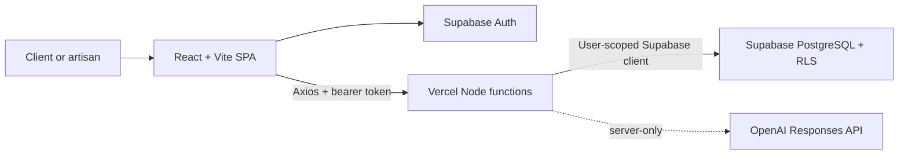

# Fixit Current-State Architecture

## Overview

Fixit is a React single-page application backed by authenticated Node.js APIs and Supabase. Vercel hosts the static Vite build and runs the API functions. Supabase is the authoritative identity and data platform.

## Runtime components

| Component | Technology | Responsibility |
| --- | --- | --- |
| Web application | React 19, Vite, React Router | Architecture workspace, marketplace, access console, login, and client-side navigation. |
| HTTP client | Axios | Calls same-origin API functions and attaches the active Supabase access token. |
| Identity | Supabase Auth | Email/password authentication, persisted browser sessions, and token refresh. |
| API facade | Node.js Vercel Functions | Validates the access token and executes user-scoped business operations. |
| Data authority | Supabase PostgreSQL | Tenants, memberships, roles, artisans, service requests, jobs, finance records, reviews, and audit history. |
| Authorization | PostgreSQL row-level security | Enforces tenant isolation and role-aware access at the data layer. |
| AI boundary | OpenAI Responses API | Reserved server-only capability; the API key is never exposed to Vite/browser code. |
| Delivery | GitHub and Vercel | Source control, builds, static hosting, API deployment, and environment configuration. |

## Application routes

| Route | Access | Purpose |
| --- | --- | --- |
| `/` | Public | Enterprise architecture reference. |
| `/login` | Public | Supabase sign-in and registration. |
| `/marketplace` | Authenticated | Separate client and artisan tenant contexts. |
| `/access` | Authenticated | Tenant users plus seven administrative tiers. |
| `/logout` | Authenticated | Clears the Supabase session. |
| `/api/marketplace` | Bearer token | Marketplace reads and service-request creation. |
| `/api/access` | Bearer token | Membership directory, audit history, and controlled role changes. |

## Security model

The browser uses only the Supabase publishable key. Every API request carries the current user's short-lived access token. The Node function verifies that token with Supabase and creates a user-scoped database client, so PostgreSQL RLS remains the final authorization boundary. Service-role keys and the OpenAI key are not shipped to the browser.

The access model deliberately does not treat tenant users as an administrative tier. Every authenticated person can hold tenant membership, while a separate platform assignment may grant one of seven tiers: Tier 1 Admin, Tier 2 Admin, Tier 3 Admin, Manager, Executive, Auditor, or Super Admin. Client and artisan marketplace assignments remain separate tenant roles.

Administrative permissions are evaluated from `platform_admin_assignments` and `role_permissions`. Role changes create immutable access-audit records and structured security events. Authorized operations staff use `/security` for governed telemetry, while Vercel Firewall events and function logs are forwarded to an external SIEM through a Log Drain.

## Deployment model

`pnpm build` runs TypeScript validation and emits the Vite application into `dist/`. Vercel serves the SPA, preserves `/api/*` for Node functions, and rewrites other routes to `index.html`. The Supabase migration under `supabase/migrations` establishes the PostgreSQL schema, RPC functions, indexes, and RLS policies.
