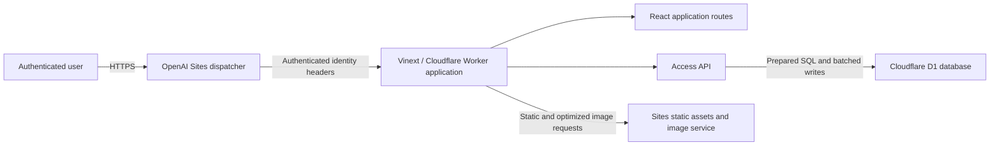
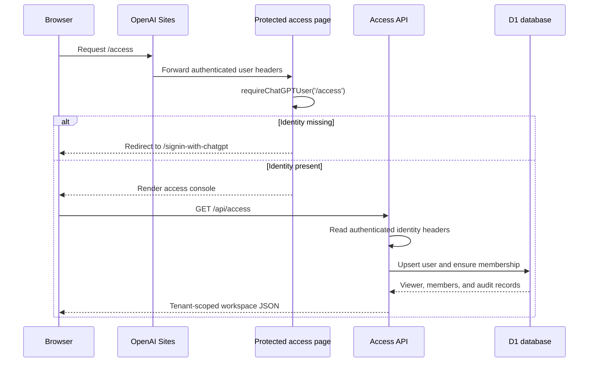
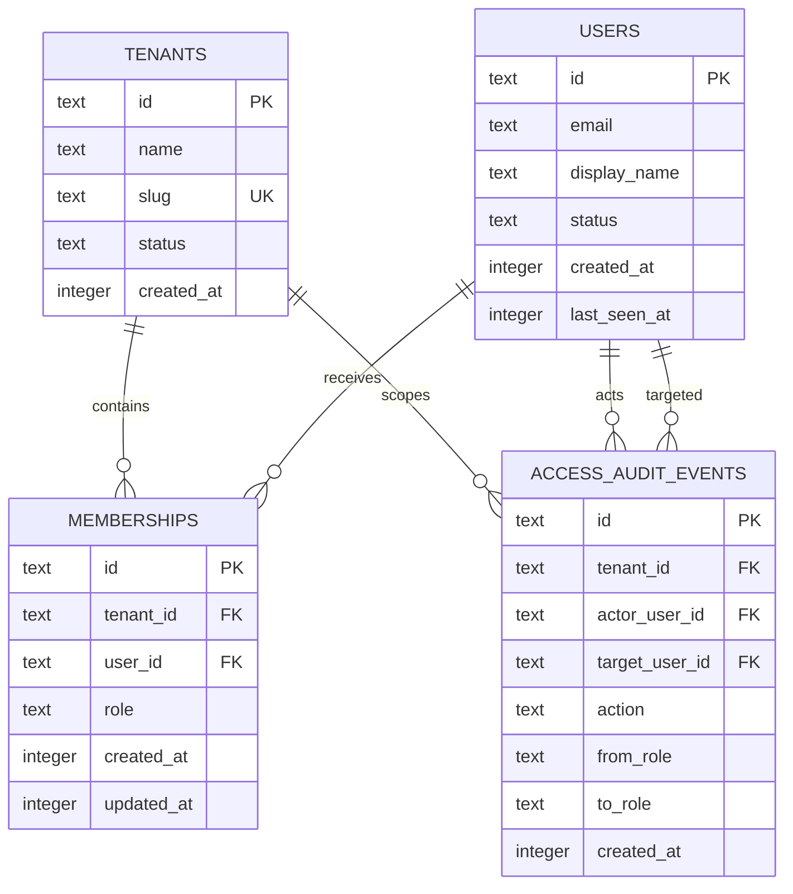
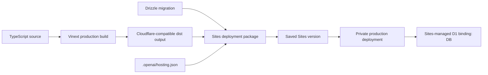

# Current-State Architecture

## 1. Document purpose

This document describes the architecture currently implemented in the Enterprise Greenfield Architecture web application. It reflects the deployed codebase as of 4 August 2026 and distinguishes implemented behavior from planned enterprise capabilities.

The application currently provides:

- A public-facing enterprise architecture workspace.
- A protected identity and tenant-governance console.
- ChatGPT-provided user authentication.
- Durable tenant, user, membership, role, and role-change audit records.
- Eight access roles, including a tenant user role separated from seven administrative roles.
- Independent `user_client` and `user_artisan` tenant-role assignments that may coexist for one identity.
- Separate automatically provisioned client and artisan tenants for each marketplace participant.
- A two-sided marketplace workspace with role and tenant switching.
- Privacy-safe artisan discovery, area/discipline/rate/rating filters, shortlisting, and request creation.
- Artisan opportunity, quotation, client, job, time, expense, invoice, finance, and review modules.
- Target-state entities for client and artisan profiles, disciplines, service areas, requests, quotes, jobs, invoices, reviews, and marketplace audit events.
- Private deployment on OpenAI Sites using a Cloudflare Worker-compatible runtime and D1 database.

## 2. System context

The OpenAI Sites dispatcher is the trust boundary for browser authentication. It forwards a stable site-scoped user ID, email address, and optional encoded full name to the application. The application does not maintain passwords, sessions, or an independent identity provider.

## 3. Deployed runtime topology

| Layer | Current implementation | Responsibility |
|---|---|---|
| Hosting | OpenAI Sites | Private deployment, access policy, source versions, production URL, and runtime bindings. |
| Edge runtime | Cloudflare Worker-compatible ESM | Receives requests, serves the application, exposes API routes, and handles image optimization. |
| Web framework | Vinext with Next.js App Router semantics | Server-rendered pages, client components, metadata, route handling, and React Server Components. |
| User interface | React 19 and TypeScript | Architecture workspace, access console, user directory, role catalogue, and audit views. |
| Styling | Tailwind CSS import plus application CSS | Responsive layouts and the enterprise visual system. |
| Persistence | Cloudflare D1, logically bound as `DB` | Users, tenants, memberships, roles, and access audit events. |
| Schema management | Drizzle ORM and Drizzle Kit | TypeScript schema definitions and versioned SQLite migration generation. |
| Object storage | Not configured | The R2 binding is currently `null`; the application does not persist uploaded files. |

Production site: `https://enterprise-greenfield-architecture.wavy-kite-6594.chatgpt.site`

## 4. Application routes

| Route | Rendering | Access | Purpose |
|---|---|---|---|
| `/` | Interactive client page | Site access policy | Presents the TOGAF-aligned architecture, BDAT domains, principles, delivery controls, roadmap, and technology baseline. |
| `/access` | Dynamic protected page plus client console | Requires ChatGPT-authenticated user | Provides tenant membership, role catalogue, role administration, and access-audit views. |
| `/api/access` `GET` | Dynamic API route | Requires authenticated identity headers | Creates or refreshes the current user profile, establishes membership, and returns the tenant workspace. |
| `/api/access` `PATCH` | Dynamic API route | Requires authentication and Super Admin role | Changes a member role and records the change in the audit trail. |
| `/marketplace` | Dynamic protected page plus client application | Requires ChatGPT-authenticated user | Provides explicit Client and Artisan tenant/role contexts and their operational workspaces. |
| `/api/marketplace` `GET` | Dynamic API route | Requires authenticated identity headers | Provisions tenant-role context and returns assignments, service requests, and feature status. |
| `/api/marketplace` `POST` | Dynamic API route | Requires active `user_client` assignment | Creates a tenant-scoped published service request and correlated audit event. |
| `/_vinext/image` | Worker endpoint | Runtime-controlled | Performs allowlisted image resizing and format conversion. |
| `/signin-with-chatgpt` | Dispatcher-owned | OpenAI Sites | Initiates sign-in; it is not implemented by application code. |
| `/signout-with-chatgpt` | Dispatcher-owned | OpenAI Sites | Signs the user out and returns them to a safe relative route. |

## 5. Authentication flow

Authentication is enforced on the server. Client-side visibility is not treated as an authorization control. API requests independently read the trusted identity headers and return `401` when identity is absent.

## 6. Tenant model

The schema supports multiple tenants, but the current provisioning flow assigns every authenticated user to one fixed tenant:

- Tenant ID: `tenant_enterprise_architecture`
- Name: `Enterprise Architecture Office`
- Slug: `enterprise-architecture-office`
- Initial status: `active`

On the first authenticated access:

1. The tenant is created if it does not already exist.
2. The authenticated user profile is inserted or updated.
3. A tenant membership is created if absent.
4. The first membership in the database receives `super_admin`.
5. All subsequent first-time members receive `tenant_user`.

The `(tenant_id, user_id)` unique index prevents duplicate memberships inside the same tenant.

## 7. Eight-role authorization model

| Role key | Display name | Intended scope | Current server-side authority |
|---|---|---|---|
| `tenant_user` | Tenant User | Own tenant workspace and assigned work | Authenticated access to the tenant console and read access to its current directory data. |
| `tier_1_admin` | Tier 1 Admin | Front-line support and basic operations | Same implemented read access as other non-Super-Admin roles. |
| `tier_2_admin` | Tier 2 Admin | Technical operations and escalations | Same implemented read access as other non-Super-Admin roles. |
| `tier_3_admin` | Tier 3 Admin | Advanced platform operations | Same implemented read access as other non-Super-Admin roles. |
| `manager` | Manager | Team, assignment, and delivery oversight | Same implemented read access as other non-Super-Admin roles. |
| `executive` | Executive | Portfolio, risk, and strategic oversight | Same implemented read access as other non-Super-Admin roles. |
| `auditor` | Auditor | Independent, read-only assurance | Same implemented read access as other non-Super-Admin roles. |
| `super_admin` | Super Admin | Platform-wide identity and role administration | May change membership roles within the current tenant. |

Important current-state distinction: all eight roles are represented in the data model and interface, but only the `super_admin` role currently has a distinct enforced mutation permission. The finer-grained capabilities shown in the role catalogue are product intent and have not yet been connected to separate business APIs.

## 8. Role-change authorization

The `PATCH /api/access` request accepts a tenant ID, target user ID, and one of the eight allowlisted roles.

The server applies the following controls:

1. The caller must be authenticated.
2. The requested role must be one of the eight compile-time allowlisted values.
3. The caller must have a membership in the supplied tenant.
4. The caller's current role must be `super_admin`.
5. The target must be a member of the same supplied tenant.
6. A Super Admin cannot remove their own Super Admin role.
7. The membership update and audit-event insert execute as one D1 batch.

The interface disables role selectors for non-Super-Admin users, but the server remains the final authorization authority.

## 9. Data architecture

### 9.1 Tables

`tenants` stores the tenant identity, URL-safe slug, lifecycle status, and creation time.

`users` stores the stable site-scoped authenticated user ID, current email, display name, lifecycle status, creation time, and last-seen time.

`memberships` connects users to tenants and assigns exactly one of the eight roles for that membership.

`access_audit_events` records role changes with the tenant, actor, target, previous role, new role, action, and timestamp.

### 9.2 Database access pattern

- Runtime code obtains the D1 binding from `cloudflare:workers`.
- Application input is passed through prepared statements with positional bindings.
- Related profile and membership initialization statements use a D1 batch.
- Role change and audit creation use a D1 batch.
- Schema changes are versioned in the `drizzle` directory.

## 10. User-interface architecture

The application has two primary experience surfaces.

### 10.1 Architecture workspace

The root experience is a responsive, content-rich architecture portal. It contains:

- Business, Data, Application, and Technology domain exploration.
- Architecture principles search.
- Enterprise control and release-gate views.
- Implementation roadmap.
- TRUST-BDAT secure engineering guardrail content.
- Approved technology baseline and non-negotiable constraints.
- Navigation to the protected access console.

This content is currently encoded in the client component and is not loaded from D1.

### 10.2 Access console

The protected access console contains:

- Current authenticated principal and resolved role.
- Active-tenant identity and status.
- Tenant member directory and search.
- Role assignment control for Super Admin users.
- Complete eight-role catalogue.
- Recent role-change audit trail.
- Responsive desktop and mobile navigation.

The console fetches authoritative membership data from `/api/access` after the protected page is rendered.

## 11. Security boundaries and controls

Implemented controls include:

- Private site deployment and sign-in-gated access.
- Server-side use of trusted authenticated-user headers.
- No application-managed passwords or access tokens.
- Dynamic rendering for identity-dependent pages and APIs.
- Server-side Super Admin verification for role mutations.
- Tenant-scoped membership and target lookups.
- Eight-value role allowlist.
- Self-demotion protection for the current Super Admin.
- Prepared SQL statements.
- Audit records for role changes.
- Unique tenant/user membership constraint.
- No service credentials exposed to browser code.

## 12. Build and deployment architecture

The source is built into a Cloudflare Worker-compatible ESM deployment. The deployment package includes the compiled application, hosting metadata, and Drizzle migrations. OpenAI Sites supplies the real D1 resource behind the logical `DB` binding.

## 13. Current limitations and architectural debt

The following are not yet implemented:

1. **Tenant provisioning and selection:** the schema is multi-tenant, but the application currently creates and uses one fixed tenant.
2. **Tenant invitation workflow:** new users become members only after authenticating and visiting the access console.
3. **Granular authorization:** Tier 1, Tier 2, Tier 3, Manager, Executive, and Auditor capabilities are documented in the interface but do not yet guard separate business operations.
4. **Last-Super-Admin invariant:** self-demotion is blocked, but there is no general database rule preventing one Super Admin from demoting the tenant's only other Super Admin.
5. **User suspension enforcement:** user and tenant statuses exist but are not yet checked on every read and write request.
6. **Audit immutability:** audit events are append-only by application convention; database triggers do not yet prohibit update or deletion.
7. **Pagination:** directory and audit queries are bounded only by current query shape; the audit feed is limited to eight records and the directory is not paginated.
8. **Invitations and email delivery:** no invitation, notification, or approval process exists.
9. **Business workflows:** the architecture, controls, roadmap, and role catalogue are reference content rather than D1-managed operational records.
10. **File/evidence storage:** R2 is not configured, so private evidence uploads and recovery workflows are not implemented.
11. **Operational telemetry:** the application has no dedicated SIEM event export, WAF-management surface, or runtime control dashboard.
12. **Automated authorization tests:** the production build passes, but dedicated negative cross-tenant and role-escalation tests have not yet been added.

## 14. Recommended next transition

The next architecture increment should establish a real tenant-administration boundary:

1. Add Super-Admin-only tenant creation, suspension, and selection APIs.
2. Add invitation-backed membership creation rather than implicit first-visit enrollment.
3. Define a permission catalogue and map each role to explicit server-side permissions.
4. Enforce active user, active tenant, and active membership status in one reusable authorization decision function.
5. Protect the last active Super Admin per tenant.
6. Add immutable audit enforcement, pagination, correlation IDs, and reason fields.
7. Add automated tests for cross-tenant access, privilege escalation, self-service restrictions, and audit completeness.

This would move the application from a tenant-aware identity foundation to a governed multi-tenant administration platform.
